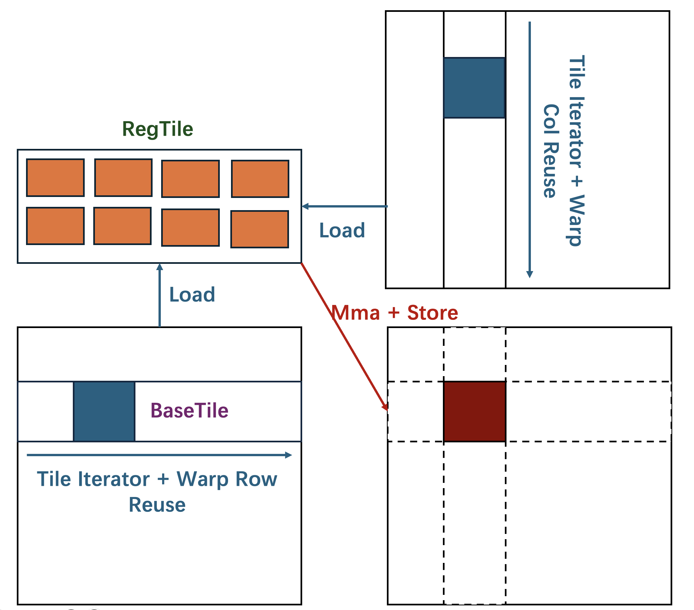

# TiledCUDA

**TiledCUDA** is a highly efficient kernel template library designed to elevate CUDA C’s level of abstraction for processing tiles. It is designed to be:

- **Higher-Level Programming**: TiledCUDA offers a set of device kernels for transferring tiles between the CUDA device's three memory hierarchies and for computing tiles.
- **Modularity**: TiledCUDA enables users to construct their applications by processing larger tiles in time and space using the provided BaseTiles.
- **Efficiency**: TiledCUDA offers highly efficient implementations of these device kernels.

TiledCUDA adopts a hardware bottom-up approach by building kernels around the core concept of the **BaseTile**. The shapes of these BaseTiles align with TensorCore's instruction shape and encapsulate hardware-dependent performance parameters to optimally utilize TensorCore's capabilities. Serving as building blocks, these BaseTiles are then combined to construct larger tiles in both temporal and spatial dimensions, enabling users to process larger tiles composed of BaseTiles for their applications.

## Latest News 🔥

- [2025/01/28] :bangbang: We have **migrated the latest developments and updates** of the TiledCUDA project to a new repository. We invite you to visit and follow our new repository at [microsoft/TileFusion](https://github.com/microsoft/TileFusion). For any questions or further assistance, please feel free to reach out to us at the new repository.

- [2024/8/30] TiledCUDA supported FlashAttention-v2, [FlashAttention-v2 Example](src/kernels/flash_attn.cu).


## Example

TiledCUDA implements `GlobalTile`, `SharedTile` and `RegTile` to customize the shape and layout of tiles located in the GPU's three memory hierarchies. Here's an example of a simple GEMM kernel written in TiledCUDA (the complete example can be found in [this directory](https://github.com/TiledTensor/TiledCUDA/tree/master/examples/cpp/gemm)):

<p align="center">

</p>

(*To simplify the demonstration, this example only involves two memory levels: global memory and registers. TiledCUDA also applies a similar concept to shared memory*.)

```cpp
template <typename InType, typename AccType, typename IteratorA, typename RegA,
          typename LoaderA, typename IteratorB, typename RegB, typename LoaderB,
          typename GlobalC, typename RegC, typename CStorer>
__global__ void simple_gemm(const InType* dA, const InType* dB, AccType* dC) {
    IteratorA gAs(dA);
    RegA rA;
    LoaderA loader_a;

    IteratorB gBs(dB);
    RegB rB;
    LoaderB loader_b;

    RegC acc;

    for (int k = 0; k < IteratorA::sc1; ++k) {
        loader_a(gAs(k), rA);
        loader_b(gBs(k), rB);
        __syncthreads();

        gemm(rA, rB, acc);
    }
    __syncthreads();

    GlobalC gC(dC);
    CStorer storer_c;
    storer_c(acc, gC);
}
```
- The `TileIterator` is used to divide the `GlobalTile` into smaller sub-tiles and iterate over them. Various warp reuse methods are provided to support efficient repeated loading of data by warps within a thread block. TiledCUDA provides efficient loading and storing methods that transfer data between memory hierarchies by utilizing specialized hardware-accelerated instructions. Tiles of data are then cooperatively loaded into the `RegTile`, which is stored in each thread's local register file.

- Once the data is loaded into a thread's local register file, `gemm` performs matrix multiplication using TensorCore's warp-level matrix multiply-and-accumulate (wmma) instruction on the `BaseTile`s. The specialized data distribution required by TensorCore is automatically maintained by TiledCUDA's `RegTile` layout.

- After the `gemm` operation is completed, data in the `RegTile` is cooperatively stored back from registers to global memory using the `RegToGlobalStorer`.

Here is how to declare the `Tile` at each level of memory, use `TileIterator` to chunk large tiles into sub-tiles, and declare loaders and storers to transfer tiles between memory hierarchies.

```cpp
using WarpLayout = RowMajor<2, 2>;

// operand A
using GlobalA = GlobalTile<InType, RowMajor<128, 256>>;
using IteratorA = TileIterator<GlobalA, TileShape<128, 32>>;
using RegA = RegTile<BaseTileRowMajor<__half>, RowMajor<8, 8>>;
using ALoader = GlobalToRegLoader<RegA, WarpLayout, kRowReuseCont>;

// operand B
using GlobalB = GlobalTile<InType, ColMajor<256, 64>>;
using IteratorB = TileIterator<GlobalB, TileShape<32, 64>>;
using RegB = RegTile<BaseTileColMajor<__half>, ColMajor<8, 4>>;
using BLoader = GlobalToRegLoader<RegB, WarpLayout, kColReuseCont>;

// output C
using GlobalC = GlobalTile<AccType, RowMajor<128, 64>>;
using RegC = RegTile<BaseTileRowMajor<float>, RowMajor<8, 8>>;
using CStorer = RegToGlobalStorer<GlobalC, RegC, WarpLayout>;
```

## Quick Start

### Download

```bash
git clone git@github.com:TiledTensor/TiledCUDA.git
cd TiledCUDA && git submodule update --init --recursive
```

### Installation

TiledCUDA requires a C++20 host compiler, CUDA 12.0 or later, and GCC version 10.0 or higher to support C++20 features.

### Unit Test

- **Run a single unit test**: `make unit_test UNIT_TEST=test_scatter_nd.py`
- **Run all unit tests**: `./scripts/unittests/python.sh`
- **Run a single cpp unit test**: `make unit_test_cpp CPP_UT=test_copy`
- **Run all cpp unit tests**: `make unit_test_cpps`
