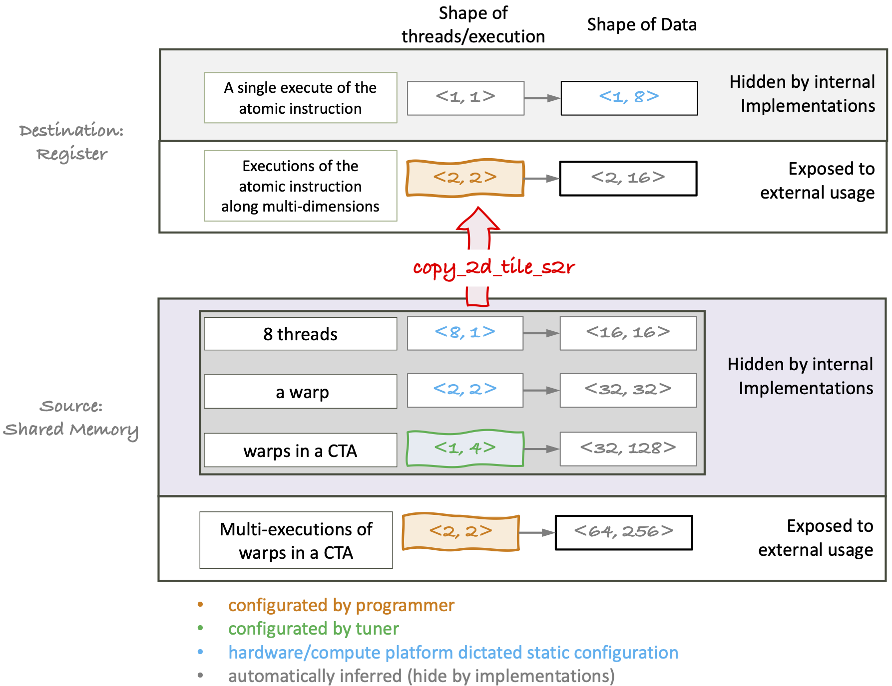

# Data transfer between shared memory and resiger file

Ampere GPUs have the ability to move two-dimensional data from shared memory to threads' local register file with a single instruction. Specifically, the `ldmatrix` instruction uses a warp to move up to four $8 \times 8$ matrices, but it requires a strict data-to-thread mapping. The macro kernel `copy_2d_tile_s2r` is to efficiently feed data to the tensor core using this warp cooperative instruction, without exposing low-level complexities.

## Goals and Non-goals

### Goals

**1. Provide a clear and understandable set of configurations.**

1. Maintain a clear separation between the declaration of ***a copy plan***, and the execution of the ***copy kernel***.
2. Once the configuration is established, how a single thread accesses data from shared memory to its local register is fully determined.

**2. Implement an clean array indexing-like syntax to enable easy access and manipulation of data tiles in the memory hierarchy by a potential code emitter.**

### Non-goals

Generalizing to non-tensor core instructions is not a priority at the moment.

## Interfaces

<p align="center">
<br>
Fig 1. Data transfer between shared memory and register file using ldmatrix.
</p>

### Declare a copy plan
 
```cpp
using Shared = SharedTile<Element, TemporalExecShared, WarpLayout,
                          ThreadLayout, ElementaryDataTileShared>;
using Reg = RegTile<Element, TemporalExecReg, ElementaryDataTileReg>;
```

The example for configuring the copy plan shown in Fig 1 above:

```cpp
/* ====== Configurated by external users ====== */
/*          for shared memory tile              */
// how many times a spatial CTA tile are executed in time
// along the two dimensions
using TemporalExecShared = TileShape<2, 2>;

/*          for register tile                   */
// how many times an atomic instruction are executed in time
// along the two dimensions
using TemporalExecReg = TileShape<2, 1>;

/* ====== Configurated by a potential internal tunner ======
 * The shared memory tile is made up of elementary data tile,
 * each of which is accessed by a single thread.
 * The following configurations describe how the elementary
 * data tiles combine to form a shared memory tile data tile. */

// how warps are laied out in a CTA
using WarpLayout = RowMajor<1, 4>;
// how threads are laid out in a single warp.
using ThreadLayout = RowMajor<16, 2>;  // fixed when using ldmatrix
// the shape of an elementary data tile for a single thread.
using ElemDataTile = RowMajor<2, 16>;

// shape of the accessed data by executing the atomic instruction for a
// single time.
using ElemDataTileReg = RowMajor<1, 8>;

// the copy plan for accessing shared memory
using Shared = SharedTile<Element, TemporalExecShared, WarpLayout,
                          ThreadLayout, ElemDataTile>;
// the copy plan for accessing register file
using Reg = RegTile<Element, TemporalExecReg, ElemDataTileReg>;
```

### Issue the copy macro kernel

```cpp
// raw shared memory data pointer
extern __shared__ __align__(sizeof(double)) unsigned char buf_[];
auto* buf = reinterpret_cast<Element*>(buf_);

Shared s_tiles(buf); // copy plan for accessing shared memory
Reg r_tile; // descriptor for a register tile
for (auto i = 0; i < Shared::sc0; ++i) { // temporal execution of the macro kernel
    for (auto j = 0; j < Shared::sc1; ++j) { // temporal execution of the macro kernel
        copy::copy_2d_tile_s2r(s_tiles[make_int2(i, j)] /*source tile*/,
                               r_tile /*destination tile*/);
    }
}
```
